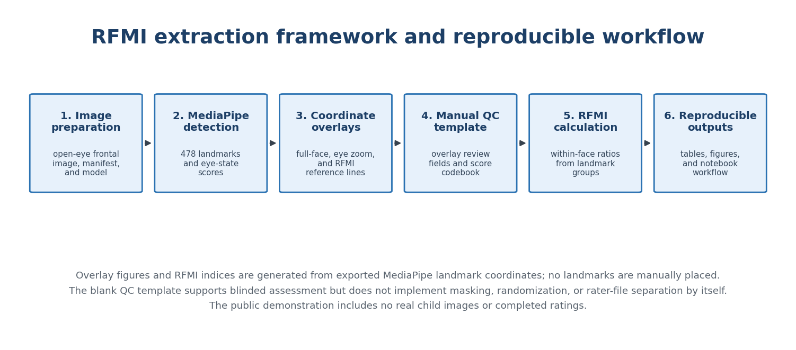
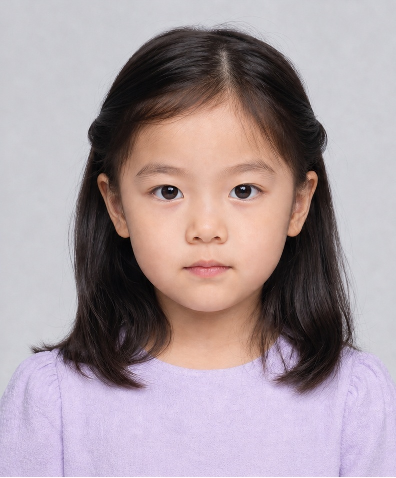
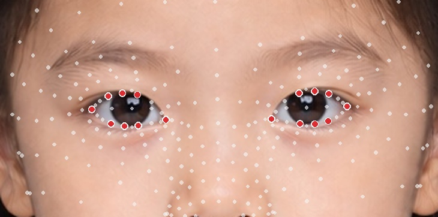
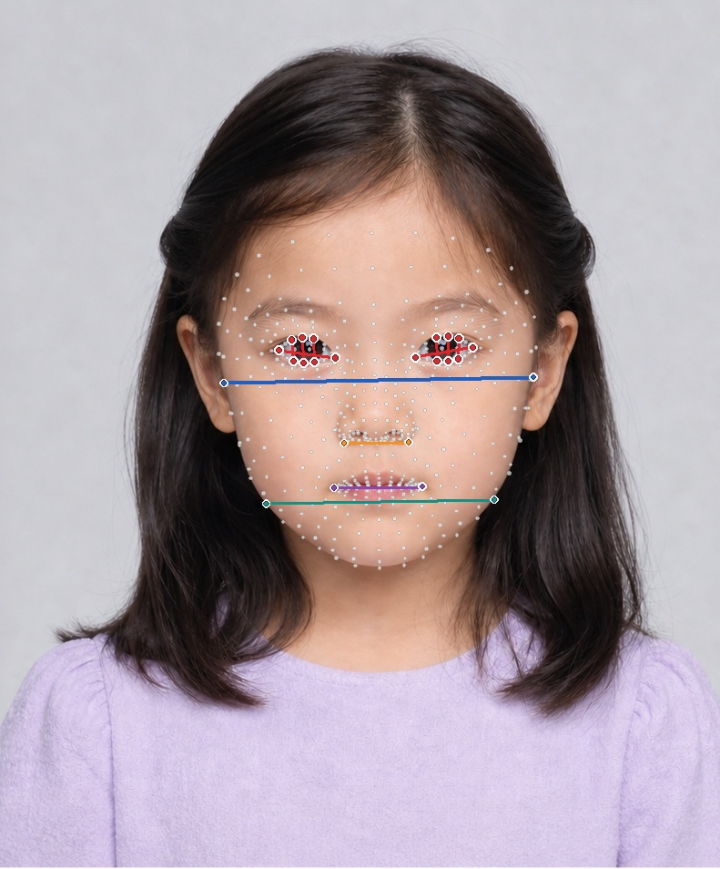
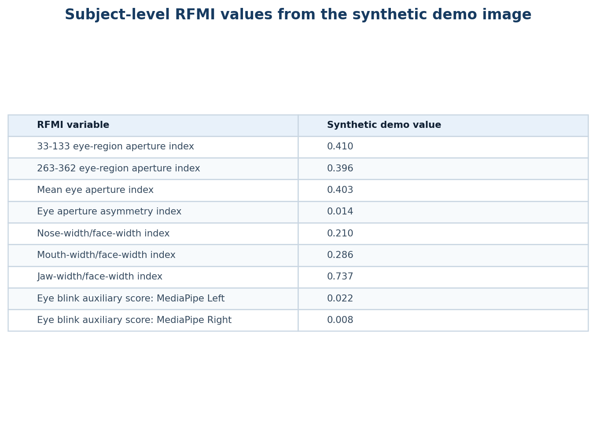
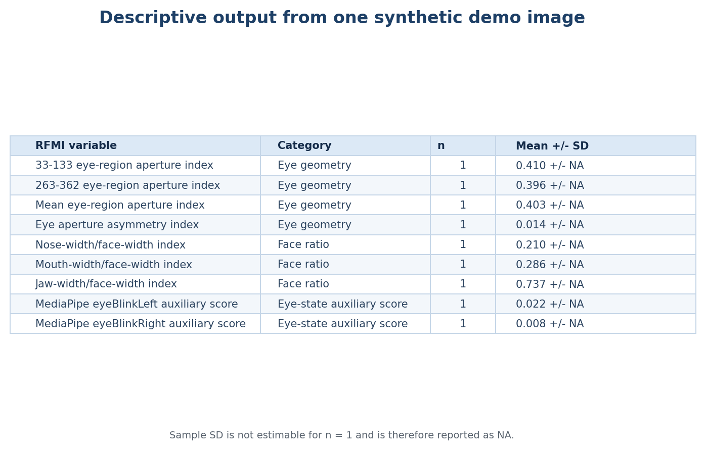

# MediaPipe Child Face RFMI Demo

This repository provides a six-part Jupyter demonstration for converting an open-eye frontal child facial image into MediaPipe Face Landmarker coordinates, coordinate-based overlay figures, relative facial morphology indices (RFMI), and simple descriptive output tables.

The repository is designed as the public code companion for a pilot feasibility study on distance-uncalibrated child frontal facial photographs. It uses one synthetic open-eye child facial image for demonstration only. No real child participant photographs, participant metadata, or study-level scoring records are included.

## Reviewer-Facing Public-Release Notes

This repository is intended to be reviewed as a transparent computational demo rather than as a release of participant-level research data. To make the public version auditable:

- the MediaPipe model URL and SHA256 hash are fixed in the preparation script;
- all overlay points and RFMI distance lines are generated from exported MediaPipe Face Landmarker coordinates;
- RFMI variables are study-defined relative image indices, not centimeter measurements and not official MediaPipe medical measurements;
- static preview figures and CSV tables are included only to show expected output structure from the synthetic image;
- real child facial images require ethics approval, consent, privacy protection, and data-governance review before processing or sharing.

Additional reviewer-oriented details are provided in [`docs/methods_rfmi.md`](docs/methods_rfmi.md) and [`docs/reproducibility.md`](docs/reproducibility.md).

## Six-Part Workflow Preview

The notebook is organized so that reviewers can see, step by step, what the code does and what each step produces.



## What Each Part Does

| Part | Code section | What the code does | What readers see after running it |
|---|---|---|---|
| Part 1 | Environment setup and synthetic input image | Imports Python packages, locates the repository root, and displays the clean synthetic open-eye image. | Printed project path and the AI-generated example image. |
| Part 2 | Manifest creation | Writes the image manifest for the one-subject public demo. | `outputs_manifest/manifest.csv` with subject ID, image state, and copied analysis path. |
| Part 3 | MediaPipe landmark detection | Runs MediaPipe Face Landmarker and exports raw coordinates. | `landmarks_raw.csv` with 478 landmark rows and `detection_log.csv`. |
| Part 4 | Coordinate-based overlay figures | Displays full-face landmarks, eye-region zoom, and RFMI distance lines. | Three overlay images generated from MediaPipe coordinates. |
| Part 5 | RFMI index calculation | Converts selected landmark distances into within-face RFMI variables. | Image-level and subject-level RFMI tables. |
| Part 6 | Summary tables and output checklist | Creates descriptive RFMI summaries and lists expected output files. | `rfmi_subject_indices.csv`, `rfmi_summary.csv`, and an output checklist. |

## Example Input and Outputs

### Part 1 input: synthetic open-eye image



### Part 4 output: full-face landmark overlay


### Part 4 output: eye-region landmark overlay



### Part 4 output: RFMI distance-line overlay



### Part 5 output: subject-level RFMI table preview



### Part 6 output: descriptive RFMI summary preview



The points and lines shown in the overlay figures are generated from MediaPipe landmark coordinates. They are not manually drawn landmarks.

## Repository Structure

```text
.
├── README.md
├── LICENSE
├── CITATION.cff
├── AI_IMAGE_DISCLOSURE.md
├── requirements.txt
├── example_data/
│   └── images/
│       └── SYN_open.jpg
├── notebooks/
│   └── BIBE_RFMI_Image_to_Indices_Demo.ipynb
├── scripts/
│   ├── 01_prepare_project.py
│   ├── 02_detect_and_overlay.py
│   ├── 04_compute_rfmi.py
│   ├── 05_summarize_rfmi.py
│   └── 06_validate_public_demo.py
└── docs/
    ├── README.md
    ├── methods_rfmi.md
    ├── reproducibility.md
    ├── figures/
    │   ├── rfmi_six_part_overview.png
    │   ├── demo_synthetic_input.jpg
    │   ├── demo_full_face_overlay.jpg
    │   ├── demo_eye_zoom_overlay.jpg
    │   ├── demo_rfmi_lines_overlay.jpg
    │   ├── demo_rfmi_subject_table.png
    │   └── demo_rfmi_summary_table.png
    └── tables/
        ├── demo_rfmi_subject_indices.csv
        └── demo_rfmi_summary.csv
```

Generated folders such as `outputs_landmarks/`, `outputs_overlay/`, `outputs_features/`, `outputs_stats/`, `models/`, and `logs/` are created when the notebook is run. They are not committed to the repository.

## How to Run

Use a clean Python environment with the pinned packages in `requirements.txt`. On minimal Linux systems, MediaPipe/OpenCV may also require runtime libraries such as `libgl1` and `libglib2.0-0`; see [`docs/reproducibility.md`](docs/reproducibility.md) for platform notes and model-download alternatives.

### Option 1: Jupyter notebook

Open:

```text
notebooks/BIBE_RFMI_Image_to_Indices_Demo.ipynb
```

Then run the notebook from top to bottom. The notebook is the recommended entry point because it displays the code, explanation, and output for each part.

The notebook automatically detects the repository root in common launch situations. If automatic detection fails, set `ROOT_OVERRIDE` in the first code cell to the local repository folder.

### Option 2: command line

From the repository root:

```bash
python scripts/01_prepare_project.py --root . --open-image example_data/images/SYN_open.jpg --child-id SYN
python scripts/02_detect_and_overlay.py --root .
python scripts/04_compute_rfmi.py --root .
python scripts/05_summarize_rfmi.py --root .
python scripts/06_validate_public_demo.py --root .
```

## Installation

Create a Python environment and install the required packages:

```bash
pip install -r requirements.txt
```

The notebook also includes an optional installation cell. Set `INSTALL = True` only when packages are not already installed in the active Jupyter environment.

## MediaPipe Model

The preparation script downloads or verifies a fixed MediaPipe Face Landmarker model:

```text
https://storage.googleapis.com/mediapipe-models/face_landmarker/face_landmarker/float16/1/face_landmarker.task
```

Expected SHA256:

```text
64184e229b263107bc2b804c6625db1341ff2bb731874b0bcc2fe6544e0bc9ff
```

Using a fixed model URL and hash improves reproducibility compared with using a moving latest-version model URL.

## RFMI Interpretation

RFMI values are relative image indices, not centimeter measurements. They are designed for distance-uncalibrated frontal photographs when the goal is to describe within-face proportional morphology.

The current demo calculates:

- right and left eye aperture indices;
- mean eye aperture index;
- eye aperture asymmetry index;
- nose-width/face-width index;
- mouth-width/face-width index;
- jaw-width/face-width index;
- selected MediaPipe eye-related blendshape scores.

All geometric RFMI values are computed from MediaPipe landmark coordinates. The RFMI formulas are study-defined features; they are not official MediaPipe medical measurements. The formulas, landmark indices, and interpretation limits are documented in [`docs/methods_rfmi.md`](docs/methods_rfmi.md).

## Data and Ethics

The included demonstration image is synthetic and AI-generated. It does not depict a real participant. Real child facial images and participant metadata should only be processed under appropriate ethics approval, consent, privacy protection, and data-governance procedures. The demo outputs are not clinical, diagnostic, or population-level study estimates.

## Citation

If you use this repository, please cite the repository using `CITATION.cff` and cite MediaPipe Face Landmarker according to the official MediaPipe documentation. For manuscripts, also report that the public demo uses one synthetic image and that RFMI variables are study-defined relative image indices.

## License

The code in this repository is released under the MIT License. See `LICENSE` for details.
